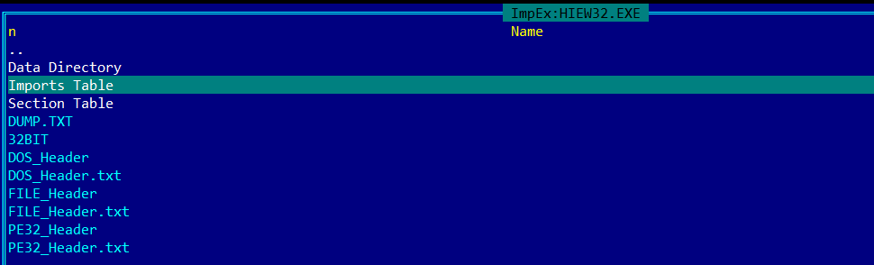
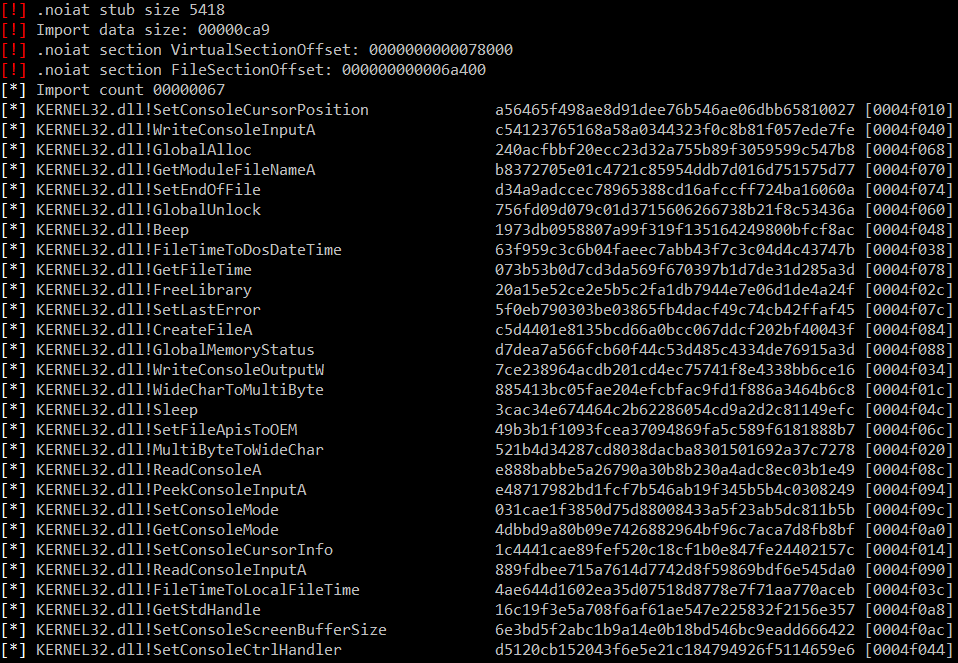
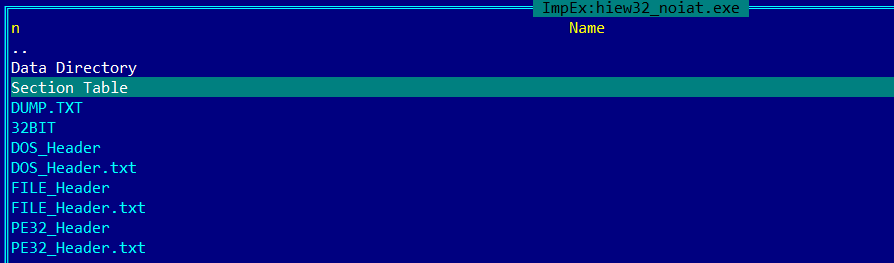

# NoIAT

Project that analyses Import Address Table of PE32 executable and adds stub that resolve it dynamically (imports cannot be read statically by no means).
CryptoPP library is used
MSVC 2022 & MinGW 8.1.0 Tested

## How to compile
You gonna need CMake and MinGW or MSVC (tested)

Compile on Windows with MSVC compiler

```
git clone --recurse-submodules https://github.com/domin568/NoIAT
mkdir build
cd build
cmake -G "Visual Studio 17 2022" ..
MsBuild.exe -nologo /property:Configuration=Release NoIAT.sln
```

Compile on Windows with MinGW compiler

```
git clone --recurse-submodules https://github.com/domin568/NoIAT
mkdir build
cd build
cmake -G "MinGW Makefiles" ..
mingw32-make
```

## Usage

```
NoIAT <exe> <out exe>
```

## Screens

Original Hiew application executable ImpEx dump

  

Executable is analysed, import names are converted to SHA1 hashed and saved to new exe's stub



New executable does not have Import Address Table visible, all imports are resolved dynamically

  

## TODO

64 bit support
